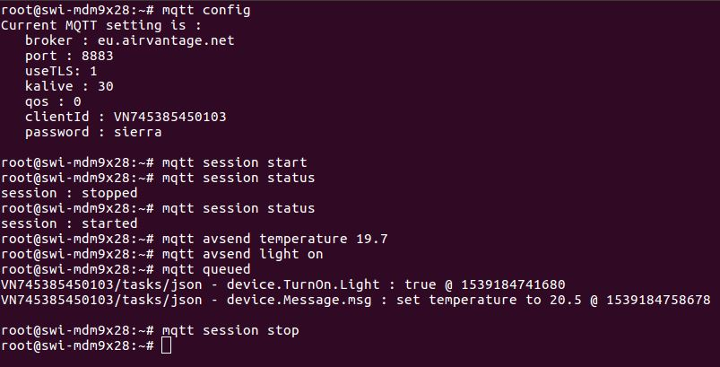
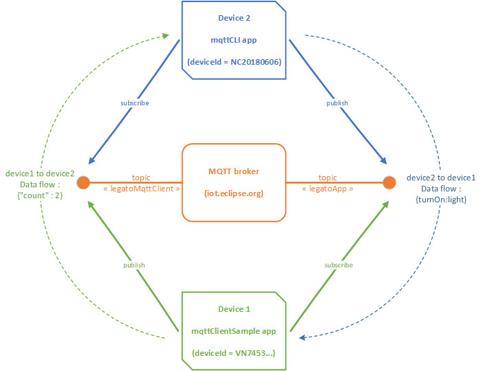
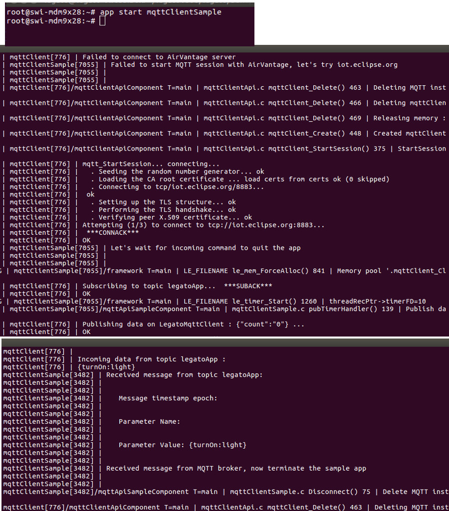
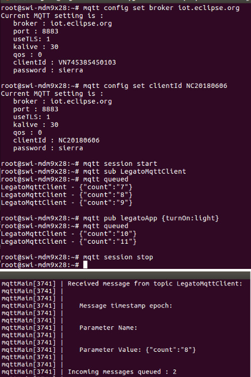
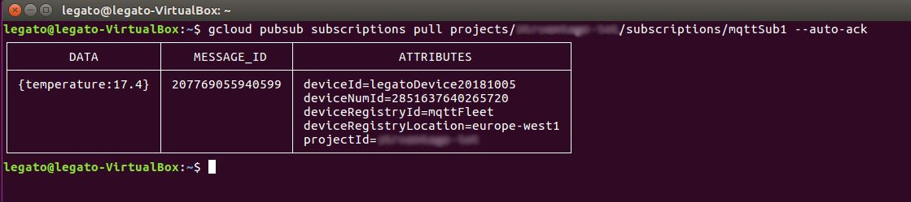

mqttClient for Legato
============

This MQTT-client API enables your application to easily interface with MQTT broker.
The following brokers have been tested :

- Sierra Wireless AirVantage server (eu.airvantage.net)
- Eclipse Paho MQTT server (iot.eclipse.org)
- Google Cloud Platform's MQTT bridge (mqtt.googleapis.com)

There are 4 separate Legato applications in this package:

- __mqttClient__ : API app exposing key MQTT features to other Legato apps over IPC (mqttClient.api). This new version can handle multiple MQTT instances (multiple Legato apps can interface with different MQTT brokers concurrently). This application must be installed on the target.
- __mqttCLI__ : Sample application implementing a Command Line Interface, it relies on the above __mqttClient__. This tool is a good starting point to explore MQTT capabilities or to test a broker, as coding is not required. You can issue commands to connect to a MQTT broker, publish data to topics, subscribe to topics, view incoming messages pertaining to subscribed topics.
- __mqttClientSample__  : Sample application showcasing how to use __mqttClient__ API to interface with a MQTT broker (AirVantage & iot.eclipse.org). You can start with this sample app to create your own mqtt app.
- __mqttGoogleCLI__ : Sample application implementing a Command Line Interface to connect to Google Cloud Platform's MQTT bridge. It relies on the above __mqttClient__. Coding is not required, so you can quickly have hands-on experience with Google's MQTT bridge. 

The __mqttClient__ API and the 3 sample apps have been tested with WP76 module running Legato18.06.
Interface with AirVantage server, Eclipse Paho server and Google Cloud Platform MQTT bridge will be shown in the below testing sections.

TLS Support
---------------------
__mqttClient__ supports TLS, using Mbed TLS v2.9.0 (Apache 2.0 licensed version).
mqttClient automatically enables TLS support if the "useTLS" parameter is set to 1.
More Root CA certificates can be added into the certs directory.

__TLS is activated by default__.

Building and Installing applications
---------------------
Modify the path in corresponding Makefile if necessary.

- __mqttClient__ API - this application __must__ be built and installed on target

    ~~~
    cd mqttClientApi
    make wp76xx
    update mqttClient.wp76xx.update 192.168.2.2
    ~~~

- __mqttCLI__ command line app - build and install this app if you want to play with MQTT command line on Legato to interface with any MQTT broker (excluding Google's MQTT bridge)

    ~~~
    cd mqttCLI
    make wp76xx
    update mqttCLI.wp76xx.update 192.168.2.2
    ~~~

- __mqttClientSample__ sample app - build and install this app if you want to test it

    ~~~
    cd mqttApiTest
    make wp76xx
    update mqttClientSample.wp76xx.update 192.168.2.2
    ~~~

- __mqttGoogleCLI__ command line app - build and install this app if you want to play with MQTT command line on Legato to interface with Google Cloud Platform's MQTT bridge

    ~~~
    cd mqttGoogleCLI
    make wp76xx
    update mqttGoogleCLI.wp76xx.update 192.168.2.2
    ~~~

Accessing Command Line Interface (CLI)
-----------------------------------------
__mqttCLI__ & __mqttGoogleCLI__ both implement a CLI. This interface is triggered by the 'app runProc' command which is not handy. Shell scripts (located in 'scripts' folder) have been provided to facilitate the execution of commands. However to achieve this, the PATH of shell scripts should be defined in the system, OR use Legato SDEF to install the scripts in the system:

1. SDEF option

    If you create a Legato system image (.update) to include MQTT apps, the below section in the SDEF file will install 'mqtt' & 'gmqtt' commands

    ~~~
    commands:
    {
        mqtt = mqttCLI:/scripts/mqtt
        gmqtt = mqttGoogleCLI:/scripts/mqtt
    }
    ~~~

2. PATH option

    This option (not persistent, for development) adds the scripts path to $PATH :

    ~~~
    export PATH=$PATH:/legato/systems/current/apps/mqttCLI/read-only/scripts:/legato/systems/current/apps/mqttGoogleCLI/read-only/scripts
    ~~~

Once paths are defined, executing __mqtt__ (mqttCLI app supporting generic MQTT brokers) & __gmqtt__ (mqttGoogleCLI app supporting Google MQTT broker only) commands will look like below:

Create a system in AirVantage
-----------------------------------------

- If you need an AirVantage trial account, [check here](https://eu.airvantage.net/accounts/signup?type=AVEP)
- Save the following sample app model with .app extension, zip it and [release the zip to AirVantage](https://doc.airvantage.net/av/reference/develop/howtos/releaseApplication/), this will release a new MQTT application on AirVantage. Change the name or revision or type if there is conflit when releasing the pacakge.
- [Create a system in AirVantage](https://doc.airvantage.net/av/reference/inventory/howtos/createSystem/), select the above application you've released in the Applications field
- Assign a password to your MQTT application
- [Activate your system](https://doc.airvantage.net/av/reference/inventory/howtos/activateSystem/)
- Go to the Monitor view

~~~
<?xml version="1.0" encoding="ISO-8859-1"?><app:application xmlns:app="http://www.sierrawireless.com/airvantage/application/1.0" type="com.sample.device" name="mqtt-sample" revision="1.0">
    <capabilities>
    
        <communication>
            <protocol comm-id="SERIAL" type="MQTT"/>
        </communication>
     
        <dm>
            <action impl="MQTT_SW_INSTALL"/>
        </dm>
                
        <data>
            <encoding type="MQTT">
                <asset default-label="Device" id="device">
                    <setting default-label="Threshold" path="counter" type="int"/>
                    
                    <command path="TurnOn" default-label="Turn on">
                        <parameter id="Light" default-label="Light" type="boolean"/>
                    </command>

                    <command path="Message" default-label="Message">
                            <parameter id="msg" default-label="msg" type="string"/>
                    </command>

                </asset>
            </encoding>
        </data>  

    </capabilities>

    <application-manager use="MQTT_SW"/>
</app:application>
~~~

Testing on AirVantage
-----------------------------------------

Before doing these tests, make sure the systems have been created in AirVantage (refer to previous section).

1. __Data exchange with AirVantage__

    __mqttClient__ & __mqttCLI__ should be installed on the target

    The default MQTT configuration is AirVantage server, the clientId is automatically set to module's serial number. Therefore starting a connection with AirVantage is straightforward, as shown below:

    
    
    

    Custom Commands (turn on light & message) sent from AirVantage can be viewed with "mqtt queued" command.

2. __Device-to-Device communication__

    __mqttClient__ & __mqttCLI__ & __mqttClientSample__ are used to test this one-to-one communication scenario.

    Sending data from Device1 to Device2 using MQTT on AirVantage:

    Device 1: mqttClientSample app acting as a device (clientId is default to module's serial number) connecting and sending data points to AirVantage. In addition to AirVantage specific 'tasks/json' topic, this sample app also subscribes to "legatoApp" topic. This app will exit upon receiving a message/command from one of the subscribed topics.

    Device 2 : We then emulate a second device (setting a different serial number) connecting AirVantage using mqttCLI. When publishing data to "legatoApp" topic, this data is forwarded to the above device (mqttClientSample app).

     

    Using the topic approach, one-to-many communication can be achieved with AirVantage using MQTT protocol.

Testing on iot.eclipse.org
-----------------------------------------

__mqttClient__ & __mqttCLI__ & __mqttClientSample__ are used to perform 2-ways device-to-device communication.

Device 1 : mqttClientSample app (clientId is default to module's serial number) first attempts to connect to AirVantage. If the connection fails, then the app will be trying to connect to iot.eclipse.org. To force the app to connect to iot.eclipse.org, let's remove the MQTT application from the device in AirVantage portal. Once connected to a broker, it subscribes to "legatoApp" topic, and pushing data to topic "LegatoMqttClient". This app will exit upon receiving a message/command from the subscribed topic.

Device 2 : Let's simulate a second device using command line app (mqttCLI). Change the broker to iot.eclipse.org and clientId to a different serial number. When connected to eclipse server, issue "mqtt sub" to subscribe to topic "LegatoMqttClient", data published by mqttClientSample app will be received here, use "mqtt queued" to view them. Let's check that data {turnOn:light} sent to "legatoApp" topic will be forward to the other device (mqttClientSample app) consuming the same topic. 

Device1 sends data points ({"count" : count}) to Device2 (via MQTT broker), and receives {turnOn:light} from Device2 :

Device2 receives data point from Device1 ({"count" : "7"}...) and publishes {turnOn:light} to Device1 :

Testing on Google Cloud Platform's MQTT bridge
-----------------------------------------

__mqttClient__ & __mqttGoogleCLI__ are used to perform the test. Google Cloud Shell (gCloud) is also used to configure MQTT device and check message sent by the device.

This sample CLI only supports RSA private/public keys to generate JWT for authentication with Google MQTT bridge.
Use openssl to generate these keys. Upload the public key to Google IOT Core for your device.

~~~
openssl genrsa -out rsa_private.pem 2018
openssl rsa -in rsa_private.pem -pubout -out rsa_public.pem
~~~

Use gmqtt commands (mqttGoogleCLI app) to configure the connection, point the rsaPrivateKey setting to the generated rsa_private.pem, start the session and send data

Use Google Cloud Shell to verify that the data published by the device has arrived in Google Clooud:

In the Google cloud console, you can send data to your device, use gmqtt queued command on the device to retrieve it (see above capture)

Using MQTT-Client within your Legato app
-----------------------------------------
After playing with the CLI to explore MQTT features or to test your MQTT broker, you could use the provided mqttClientSample as a starting point to develop your own Legato application to send/receive MQTT message.

mqttClientSample starts with configuring 2 timers: one for calling mqttClient_ProcessEvent() on a regular basis to check for incoming message and to send ping requests. The second timer is used to publish a data point every 30 seconds.

A MQTT instance is created (mqttClient_Create) with default settings (AirVantage broker, module's serial number) and data connection is requested.

Upon gaining data connection, the mqtt session is started (mqttClient_StartSession), trying to connect to AirVantage. If this session fails (e.g. device not registered in AirVantage) then a new MQTT instance is created to attempt to connect to iot.eclipse.org server. If this fails again then the app will stop.

Once connected to the broker, the app registers a callback (mqttClient_AddIncomingMessageHandler) to handle server originated messages (subscribed topics). A subscription to "legatoApp" topic is requested (mqttClient_Subscribe). If target server is AirVantage, mqttClient also automatically subscribes to AirVantage's "FSN/tasks/json" topic. Data pushing timer is started.

Data ({"count" : counter}) publishing (mqttClient_PublishKeyValue, mqttClient_Publish) is triggered by the timer. In this sample app, the recipient topic name is left blank. In this case, mqttClient will automatically define a topic : if the target server is AirVantage then the topic is "FSN/messages/json", otherwise the topic is default to "LegatoMqttClient".

Upon receiving a message from the broker (subscribed topic), it just quit the app to end the demo.

